# How to install Fedora - GNOME Workstation

This guide shows how to install Fedora with the GNOME desktop.

> ⚠️ **Warning:** Installing Fedora using this guide will completely format the target drive and **erase all existing data**. Make sure to back up any important files before proceeding.

---

## What You Will Need

1. A USB drive with Ventoy installed on it (see [create Ventoy drive](../ventoy-usb-creation-guide/))
2. A computer to install Fedora onto with at least 20 gigabytes of free space.
3. An active internet connection.

Insert your USB drive into your computer before starting.

---

## How To Get The Fedora ISO Image

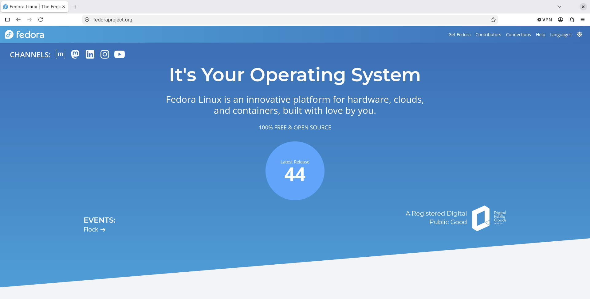

1. Go to [https://fedoraproject.org](https://fedoraproject.org)
2. Click on the large number in the middle. 

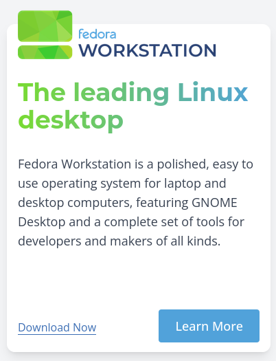

3. Click on the download now button.

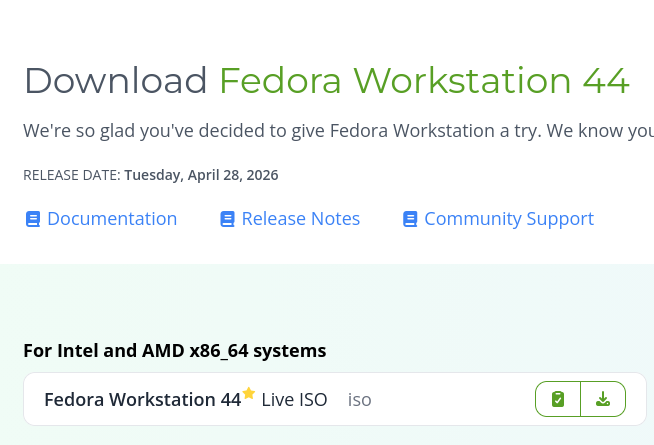

4. Click on the download arrow under "For Intel and AMD x86_64 systems".

5. [Create a Ventoy USB Drive](../ventoy-usb-creation-guide)

6. Copy the downloaded Fedora ISO image to the Ventoy drive.

## Boot Into Fedora Live Image

1. Start your computer and press the relevant function key to bring up the boot menu. ([Boot Menu Keys](../bootkeys/))

2. Choose your USB drive.

3. Choose Fedora from the Ventoy menu.

4. Boot into normal mode.

## Install Fedora

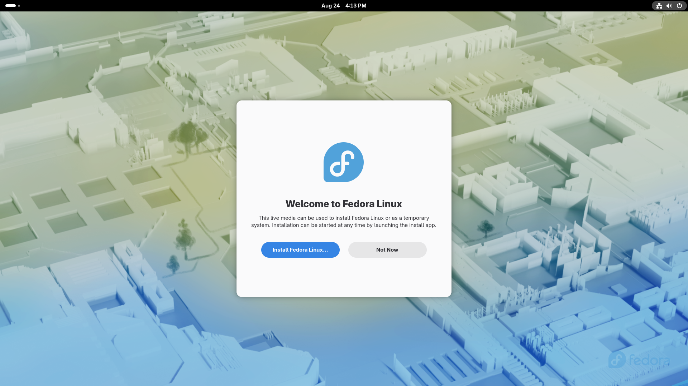

1. Click on the install button.

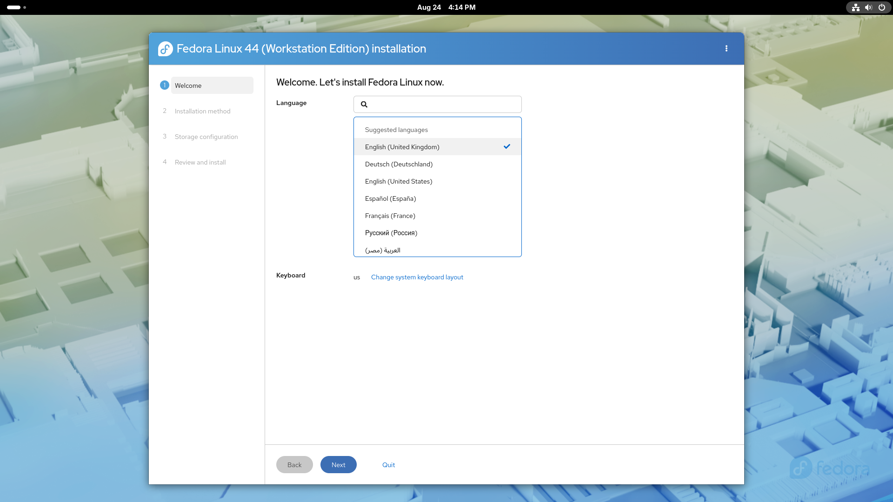

2. Choose your installation language and click next.

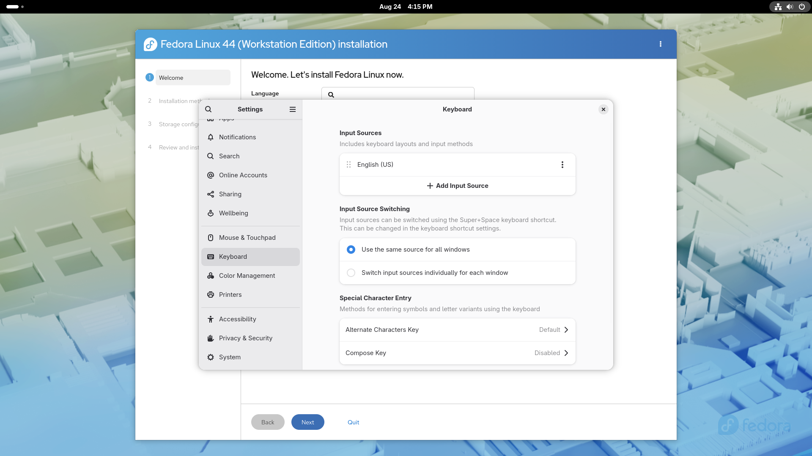

3. Choose your keyboard layout and click next.

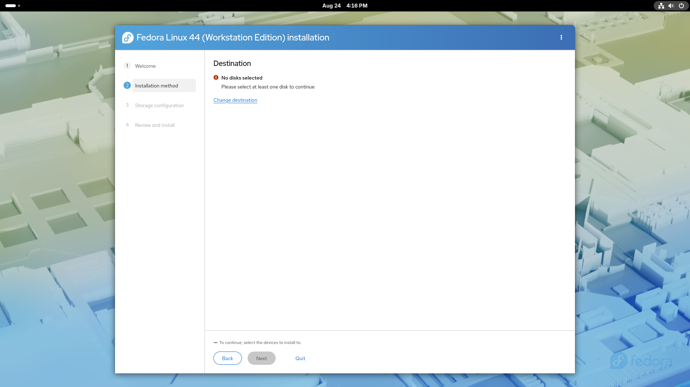

4. Click on change destination and click next.

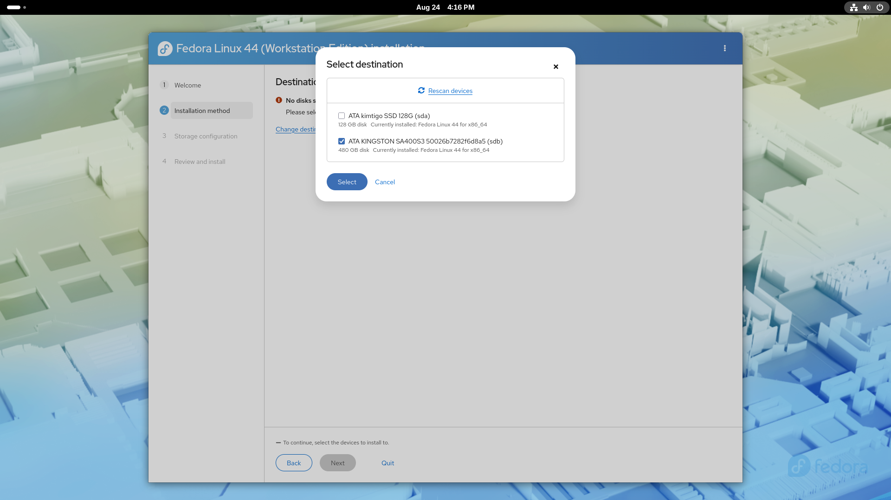

5. Choose the drive you want to install Fedora onto and click select.

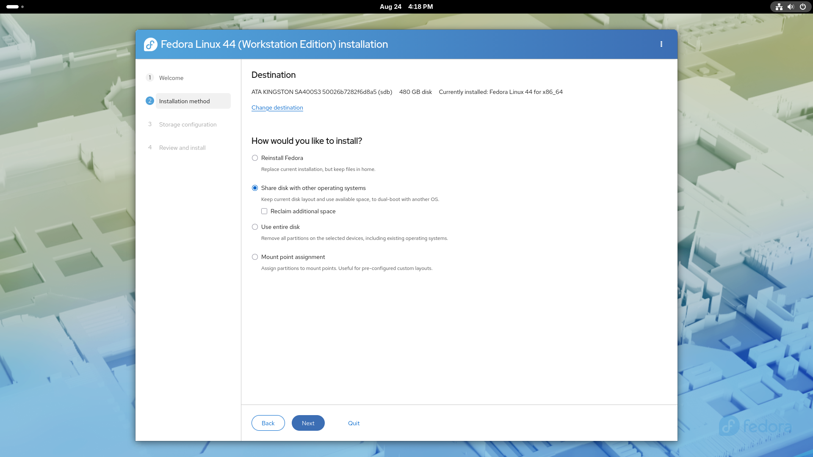

6. Choose where you want to install Fedora (recommended option is entire disk) and click next:

|Option|Description|
|-|-|
|Reinstall Fedora|This only appears if you have Fedora already installed|
|Share disk with other operating systems|Used for dual booting with another operating system such as Windows|
|**Use entire disk**|Install Fedora as the only operating system|
|Mount point assignment|Manual partitioning - for experts|

> ⚠️ **Warning:** - Make sure you have backed up before choosing any of these options.

7. Choose whether to encrypt your data or not and click next.

* If you encrypt your data and forget the encryption password you will no longer be able to access your files.

* If you don't encrypt your data then anybody who has access to your physical computer can potentially see your files.

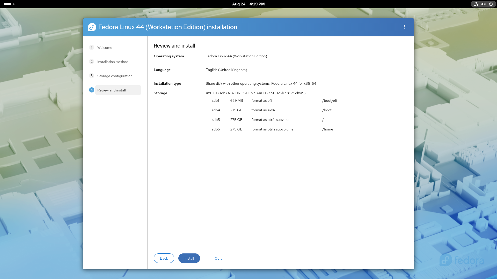

8. Review the selections made and if you are happy to continue click install.

> ⚠️ **Warning:** - This is the point of no return. Make sure you have backed up any important files first.

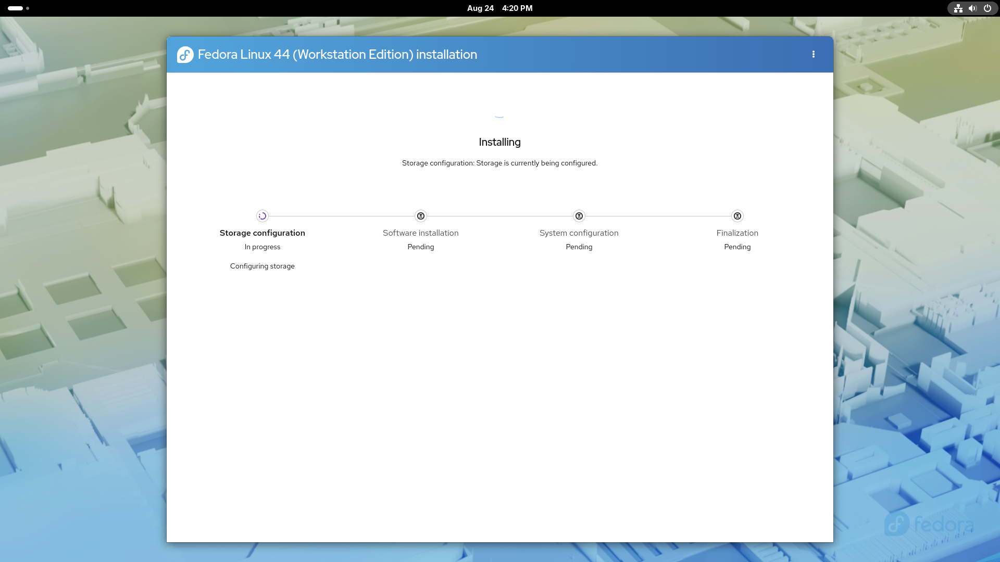

The installation will now begin and it can take 15 to 20 minutes depending on the computer you are using.

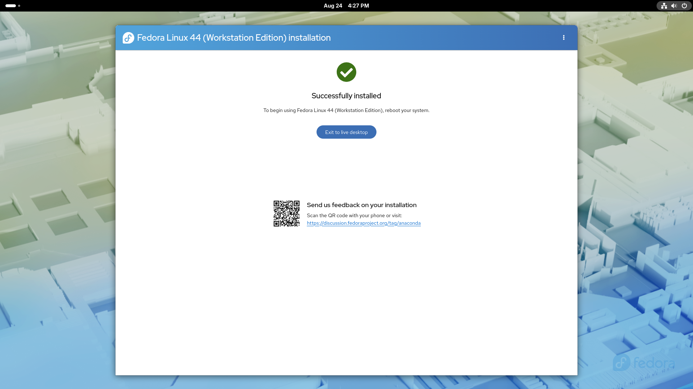

When the installation has finished you should see an option to exit to live desktop. Click on this button.

Restart the computer by clicking on the power icon in the top right corner and then choose the power icon again and choose restart.

## Post Installation Setup

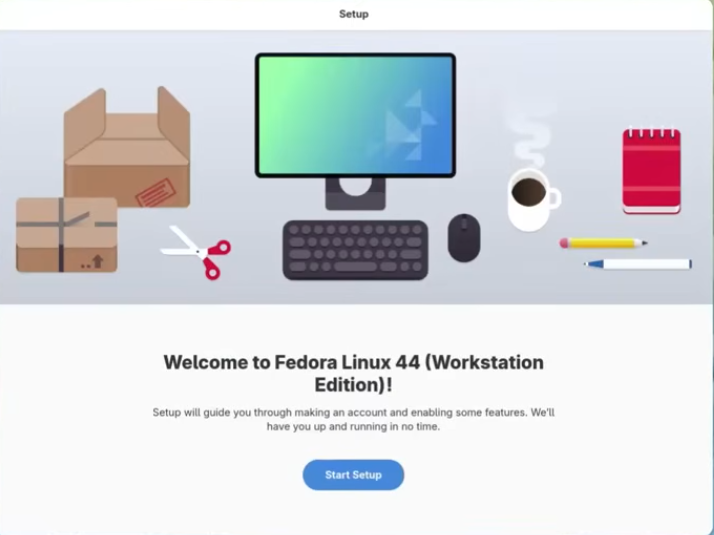

After you reboot, you can remove the USB drive and you will be taken to the Fedora setup screen.

1. Click on "Start Setup".

2. Choose whether you want location services on or off and whether you want to report any problems you find automatically to Fedora and then click next.

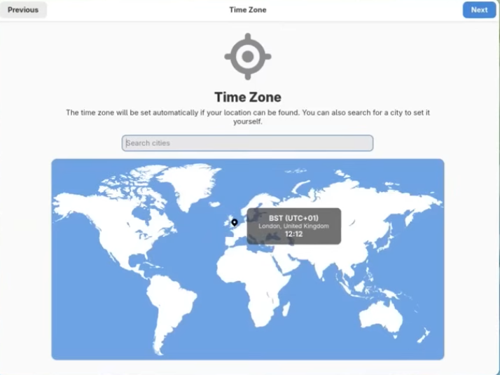

3. Choose where you are in the world by clicking on the map or enter your nearest city and then click next.

4. Choose whether to enable 3rd party repositories and then click next.

    **Note:** It is recommended that most users click this button. 

5. Enter your full name and a username that you want to use to login and click next.

6. Enter the password you want to use and repeat it and click next.

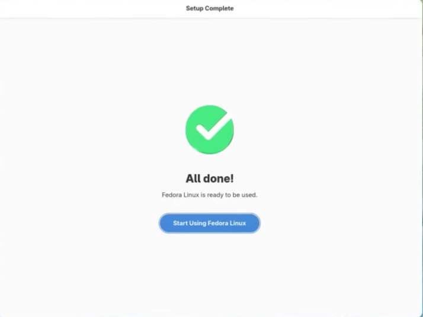

The setup is now complete and you can now use Fedora.

