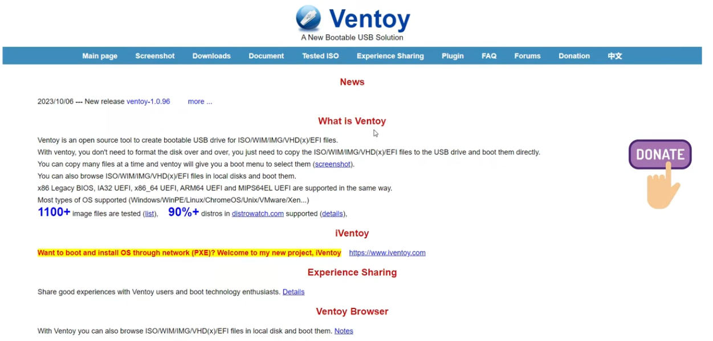
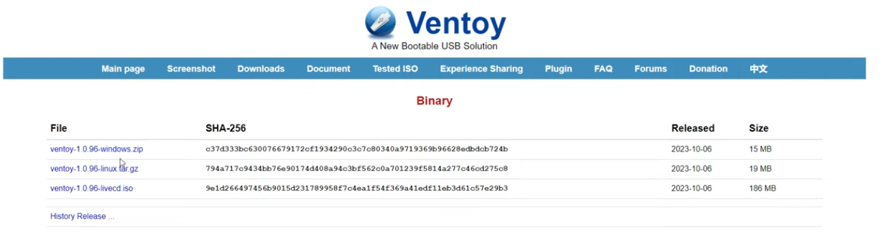
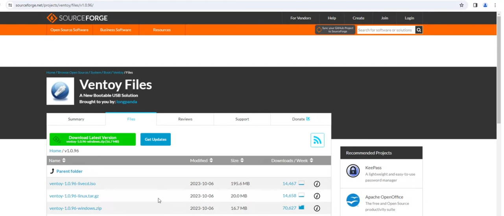
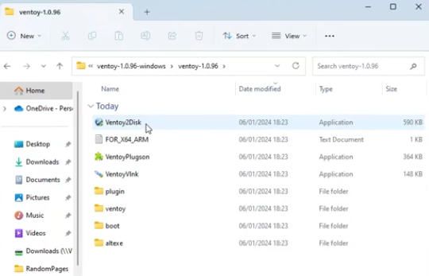
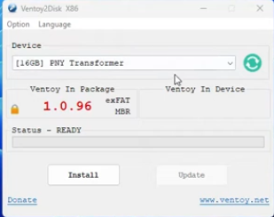
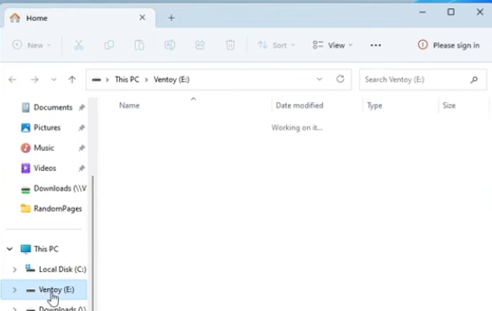
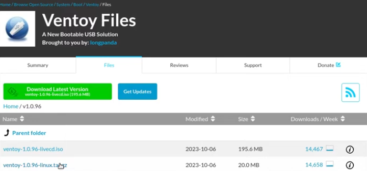
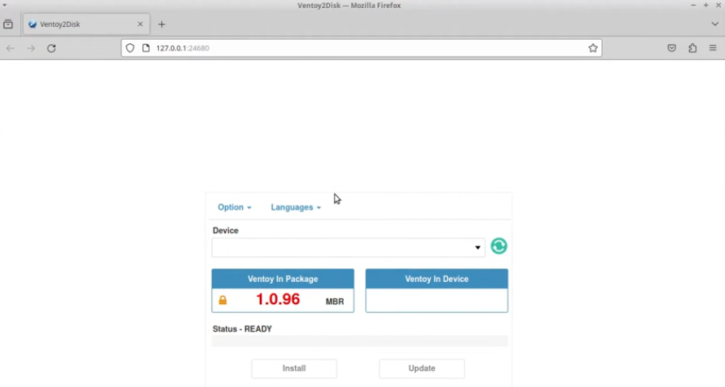
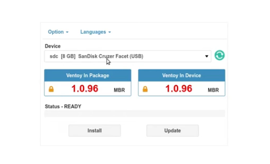

# How to Create a Multiboot Linux USB Drive Using Ventoy

To try out Linux or install it on your computer, you will need to create a bootable USB drive containing your preferred distribution. 

The best tool for this is **Ventoy**. Unlike standard bootable USB creation tools, Ventoy allows you to install the bootloader once. Afterward, you can simply drag and drop multiple ISO files onto the drive without formatting it again.

> ⚠️ **Warning:** Installing Ventoy will completely format the target USB drive and **erase all existing data**. Make sure to back up any important files before proceeding.

[](https://youtu.be/XpU0Izix3Yk?si=VCp5otwQ1s1mhSdf)

[View the video](https://youtu.be/XpU0Izix3Yk?si=VCp5otwQ1s1mhSdf)


---

## What You Will Need

1. A blank USB drive (8 GB or higher recommended)
2. One or more Linux ISO files
3. An active internet connection

Insert your USB drive into your computer before starting.

---

## Download Ventoy



1. Go to [ventoy.net](https://www.ventoy.net).
2. Click on the **Downloads** link in the top menu bar.



---

## Windows Users



1. Download the **Windows zip file** (e.g., `ventoy-x.x.xx-windows.zip`).
2. Open Windows Explorer and navigate to your **Downloads** folder.
3. Right-click the downloaded Zip archive and select **Extract All...**



4. Open the extracted folder and launch **`Ventoy2Disk.exe`**.



5. Select your USB drive from the **Device** drop-down menu.
   > **Double-check:** Ensure you have selected the correct drive letter to avoid overwriting another storage device.
6. Click **Install** and confirm both warning prompts to proceed with formatting.



7. Once complete, open Windows Explorer. You will see a newly created volume named **Ventoy**.
8. Copy your downloaded Linux ISO files and paste them directly onto the Ventoy drive.

---

## Linux Users



1. Download the **Linux tar.gz file** (e.g., `ventoy-x.x.xx-linux.tar.gz`).
2. Open a terminal window and navigate to your Downloads folder:
   ```bash
   cd Downloads
    ```

3. Type `ls` to list your downloaded files and confirm the exact archive name.
4. Extract the `.tar.gz` archive (replace `ventoy-1.0.96.tar.gz` with your actual file name):
    ```bash
    tar -xzvf ventoy-1.0.96.tar.gz
    ```


5. Navigate into the extracted Ventoy directory:
    ```bash
    cd ventoy-1.0.96
    ```


6. Type `ls` to view the folder contents.
7. Launch the Ventoy Web server application:
    ```bash
    sudo ./VentoyWeb.sh
    ```
    


8. Your web browser should open automatically and show the Ventoy2Web screen.



9. Select your target USB drive from the device list, verify it is correct, and click **Install**.
10. Confirm the warnings to complete the installation.
11. Once Ventoy is installed, stop the application and close the browser.
12. Open your file manager, navigate to your Downloads folder, and copy the Linux ISO image you want to use.
13. Open the **Ventoy** drive partition and paste the ISO file directly into it.

---

## Testing the USB Drive

1. Restart your computer.
2. Press your system's boot menu key during startup (See [boot key list](../bootkeys/)).

3. Select the Ventoy USB drive from the boot list.

4. The Ventoy menu will launch, showing all copied ISO files. Pick the Linux distribution you wish to load.

5. Select **Boot in normal mode**.

